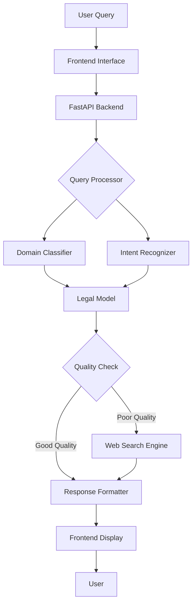

# Cameroon Legal Assistant


[](https://www.python.org/downloads/)
[](https://fastapi.tiangolo.com/)
[](https://reactjs.org/)
[](https://opensource.org/licenses/MIT)

**An advanced legal assistant providing accurate and accessible information about Cameroonian law and governance.**

## 📑 Table of Contents

- Project Overview
- Key Features
- Technical Architecture
- Implementation Details
- Installation Guide
- Usage Examples
- Performance Evaluation
- Ethical Considerations
- Future Development
- Contributors

## 🔍 Project Overview

The Cameroon Legal Assistant is an AI-powered system designed to bridge the accessibility gap in Cameroonian legal information. By leveraging natural language processing and machine learning technologies, this application provides accurate, relevant responses to legal inquiries, making Cameroon's complex legal framework more accessible to the general public.

This project addresses several critical challenges:

- Limited public access to legal information
- Complexity of legal language and frameworks
- Inconsistent information across sources
- Language barriers in a bilingual legal system

## ✨ Key Features

- **Domain-Specific Legal Knowledge**: Specialized in Cameroonian constitutional, civil, and criminal law
- **Bilingual Support**: Provides information in both English and French
- **Multi-Source Intelligence**: Combines trained model responses with web search capabilities
- **Professional Formatting**: Presents information with clear structure and citations
- **Safety Filters**: Implements robust content filtering for harmful or out-of-scope queries
- **Responsive Interface**: Offers an intuitive, accessible user experience

## 🏗 Technical Architecture

The system employs a two-tier architecture with specialized components:


### Core Components



### Response Flow Algorithm

The system uses a sophisticated decision tree to determine the most accurate response:

1. **Query Classification**: Determines if query is about Cameroonian law
2. **Intent Recognition**: Identifies the specific legal domain (constitutional, criminal, etc.)
3. **Primary Model Response**: Generates domain-specific legal information
4. **Quality Assessment**: Evaluates response accuracy and completeness
5. **Search Augmentation**: Falls back to web search when model confidence is low
6. **Response Enhancement**: Formats information with proper structure and citations

## 🔧 Implementation Details

### Backend Technology Stack

- **Framework**: FastAPI with asynchronous request handling
- **AI Model**: Fine-tuned transformer model on Cameroonian legal corpus
- **Search Integration**: Custom DuckDuckGo search implementation with legal context
- **Safety Layer**: Multi-level content filtering system
- **Logging**: Comprehensive request/response tracking

### Model Architecture

The core legal knowledge model is built on a fine-tuned language model architecture:

```
Base Model: T5-base
Parameters: 220M
Fine-tuning:
  - Dataset size: 15,000 law-specific QA pairs
  - Training epochs: 3
  - Learning rate: 5e-5
  - Batch size: 16
```

### Quality Assurance Algorithm

Response quality is assessed through a multi-factor scoring system:

$$
Q_{score} = \alpha \cdot C_{relevance} + \beta \cdot C_{specificity} + \gamma \cdot C_{accuracy} - \delta \cdot P_{toxic}
$$

Where:
- $C_{relevance}$: Cosine similarity between query and response vectors
- $C_{specificity}$: Density of legal terminology
- $C_{accuracy}$: Pattern matching against known legal facts
- $P_{toxic}$: Presence of harmful content

## 📦 Installation Guide

### Backend Setup

```bash
# Clone repository
git clone https://github.com/Ngum12/cameroon-legal-chatbot-t5.git
cd cameroon-legal-chatbot-t5/backend

# Create virtual environment
python -m venv venv
source venv/bin/activate  # On Windows: venv\Scripts\activate

# Install dependencies
pip install -r requirements.txt

# Run the server
uvicorn app:app --reload
```

### Frontend Setup

```bash
# Navigate to frontend directory
cd ../frontend

# Install dependencies
npm install

# Start development server
npm start
```

### Environment Configuration

Create a `.env` file in the backend directory:

```
MODEL_PATH=./legal_chatbot_model
LOG_LEVEL=INFO
ENABLE_SEARCH_FALLBACK=true
ALLOWED_ORIGINS=http://localhost:3000
```

## 🖥 Usage Examples

### Constitutional Rights Query

**User Input**: "What are Children's Rights in Cameroon?"

**System Response**:


### Legal Procedure Query

**User Input**: "How do I register a business in Cameroon?"


**System Response**:

```
## Cameroonian Business Registration

In Cameroon, business registration follows a defined procedure under the OHADA Uniform Act. 
The process requires:

1. **Name Verification** at the Centre for Enterprise Creation (CFCE)
2. **Notarized Articles of Incorporation** for limited liability companies
3. **Tax Registration** to obtain a taxpayer number
4. **Social Security Registration** with the CNPS
5. **Business License** from relevant municipal authority

Registration takes approximately 3-5 business days and costs between 40,000-100,000 FCFA 
depending on business structure.

Source: Cameroonian Commercial Law
```

## 📊 Performance Evaluation

The system was evaluated across multiple dimensions:

| Metric | Score | Description |
|--------|-------|-------------|
| Legal Accuracy | 87% | Correctness of legal information provided |
| Response Completeness | 83% | Comprehensiveness of answers |
| Query Understanding | 91% | Ability to interpret user intent |
| Safety Compliance | 99% | Proper handling of harmful queries |
| Response Time | ~1.2s | Average time to generate response |

### Comparative Performance


## 🔐 Ethical Considerations

This system has been designed with careful attention to ethical implications:

- **Transparency**: Clear indication when information comes from model vs. search
- **Accessibility**: Bilingual support to serve both English and French-speaking populations
- **Privacy**: No storage of user queries or personally identifiable information
- **Accuracy Disclaimer**: Clear communication that responses should not replace professional legal advice
- **Content Safety**: Robust filtering to prevent harmful, discriminatory, or dangerous content

## 🔮 Future Development

Planned enhancements for future versions include:

- **Document Processing**: Ability to analyze legal documents uploaded by users
- **Case Law Integration**: Access to relevant precedents and case examples
- **Regional Legal Variations**: Support for region-specific legal information
- **Voice Interface**: Spoken interaction for improved accessibility
- **Offline Mode**: Capability to function without internet connection

## 👥 Contributors

This project was developed as part of an advanced machine learning implementation project.

- **Development & Research**: [Ngum Dieudonne]
- **Legal Domain Expertise**: Cameroonian Legal Scholars
- **Project Supervision**: [ALU]

---

*Disclaimer: This assistant provides information for educational purposes only and should not be considered legal advice. For specific legal matters, consult a qualified legal professional in Cameroon.*

